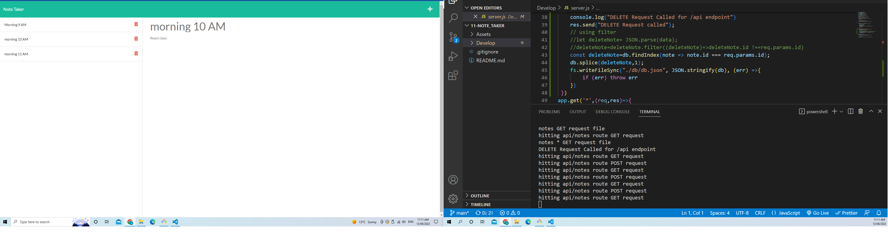
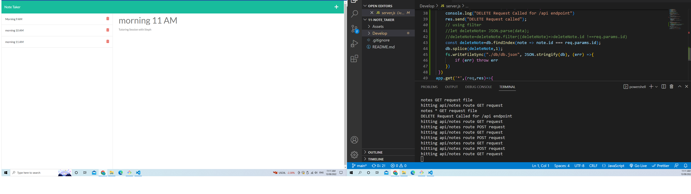
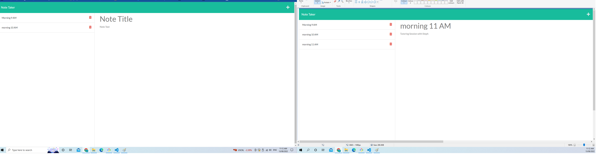

# 11 Express.js: Note Taker

## Your Task

This application is used to write and save note. This application use Express.js use as back end and also it retrives data from JSON file(db file). Using GET POST and DELETE request we can post data through Insomnia and also can retrive data through this.

The entire application is deployed in HEROKU.


## User Story

```
AS A small business owner
I WANT to be able to write and save notes
SO THAT I can organize my thoughts and keep track of tasks I need to complete
```


## Acceptance Criteria

```
GIVEN a note-taking application
WHEN I open the Note Taker
THEN I am presented with a landing page with a link to a notes page
WHEN I click on the link to the notes page
THEN I am presented with a page with existing notes listed in the left-hand column, plus empty fields to enter a new note title and the note’s text in the right-hand column
WHEN I enter a new note title and the note’s text
THEN a Save icon appears in the navigation at the top of the page
WHEN I click on the Save icon
THEN the new note I have entered is saved and appears in the left-hand column with the other existing notes
WHEN I click on an existing note in the list in the left-hand column
THEN that note appears in the right-hand column
WHEN I click on the Write icon in the navigation at the top of the page
THEN I am presented with empty fields to enter a new note title and the note’s text in the right-hand column
```


## Mock-Up

The following images show the web application's appearance and functionality:







## Getting Started

On the back end, the application includes a `db.json` file that will be used to store and retrieve notes using the `fs` module.

The following HTML routes are created:

* `GET /notes` should return the `notes.html` file.

* `GET *` should return the `index.html` file.

The following API routes should be created:

* `GET /api/notes` will read the `db.json` file and return all saved notes as JSON in JSON file(DB)

* `POST /api/notes` will receive a new note to save on the request body, add it to the `db.json` file, and then return the new note to the client. 

`DELETE /api/notes/:id` will receive a query parameter that contains the id of a note to delete. To delete a note, I need to read all notes from the `db.json` file, remove the note with the given `id` property, and then rewrite the notes to the `db.json` file.

#Deployment
[Github repo] sudheer313/11-note_taker<br>
[Github URL here] https://github.com/sudheer313/10-team-profile-generator<br>
[Live webpage URL git hub](https://sudheer313.github.io/10-team-profile-generator/)<br>
[Live webpage URL Heroku](https://sudheer313.github.io/10-team-profile-generator/)<br>

## Built with

- node js
- Express.js
## Installation

- NPM Install
- nodemon (not mandatory)
- uuidv install
## Features
It lets user to add and notes and save notes. It also allows user to delete entered notes. It is also deloyed in heroku.

## Credits
1. ASK BCS
2. referred https://github.com/jessamyn27/Notetaker-with-Express
3. referred https://github.com/ashachakre0906/note-taker
4. https://devcenter.heroku.com/articles/getting-started-with-nodejs#deploy-the-app

## What we learned

This is a basic application to learn Express.js. I learned to create ExpressJS app connection to backend and also creating a local Host. Through Insomnia I learned to understnad GET and POST commands using this application. I also learned to create a delete ruest using few referrences.

## Challenges
At start it was hard for me to understand how to connect my back end to front end . I also had troule understandig GET and POST requests. MOst importantly I learned how to connect my JSON file to execute GET and POST commands. I had few issues wit Heroku.  After practicing class Activities and asking ASK BCS helped me to ovecome this challanges.I also thank jessamyn27 and ashachakre0906.
I am also thankful and proud of myself for not giving up and keep trying untill I managed to learn this.

## Author

@Sudheer kandula


